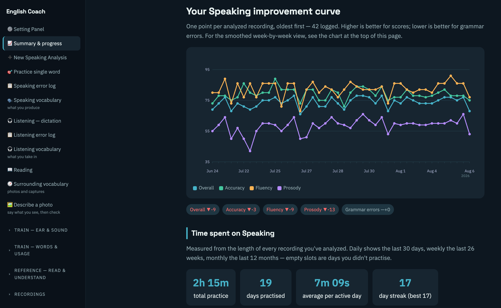
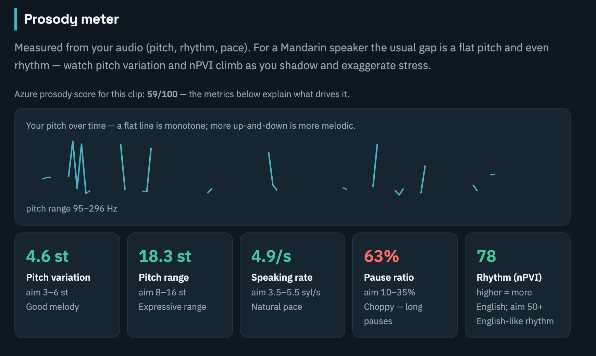

# English Coach

A self-hosted English pronunciation and speaking coach, built for a specific
problem: **generic language apps score you on whether you were understood.
They don't tell you which sound you are physically making wrong, or which
mistakes you keep repeating.**

This app records you speaking, then produces one diagnosis that combines four
independent signals:

| Signal | Source | What it catches |
|---|---|---|
| Phoneme accuracy | Azure Pronunciation Assessment | the specific words and sounds a listener would misjudge |
| Grammar & word choice | LLM (DeepSeek or Claude) | tense drift, dropped articles, translated-sounding phrasing |
| Prosody | a pure-NumPy pitch/rhythm analyzer | monotone delivery, syllable-timed rhythm, pace, phrasing |
| Recognition errors | Whisper's own mistakes | mis-transcriptions treated as evidence about *your* production |

That last row is the idea the project is built around. When a speech recognizer
hears "rope" as "lobes", that is not a bug to work around — it is a measurement.
The recognizer failed in the same way a human listener would, and it tells you
exactly which sound to drill.

Everything runs locally. Transcription and prosody analysis never leave the
machine; only the optional grammar check, pronunciation scoring, and photo
vocabulary capture call an API.



## What's inside

The app is a single dashboard with **17 training panels** organised around
what you're working on, plus a **Setting Panel** for API keys, prompts and
login (covered under [API keys](#api-keys) and [Login](#login) below, not in
this table — it's configuration, not training):

### Speaking
| Panel | What it does |
|---|---|
| 📈 Summary & progress | average pronunciation score by week (speaking, reading passage, single word); improvement curves across pronunciation, accuracy, fluency, prosody; recurring blind spots; per-word drill list |
| 🎯 Practice single word | say a word, get an instant Azure accuracy score — every attempt is logged so you can watch a specific word improve |
| 📖 Reading | reread the polished version of one of your own past recordings, scored against it |
| 📋 Speaking error log | grammar and word-choice mistakes aggregated across sessions |
| 🗣️ Speaking vocabulary | how much distinct vocabulary you actually produce, growth over time, and the words you're recycling |
| 📣 How-to: tricky words | step-by-step articulation guides for problem sounds |

### Listening
| Panel | What it does |
|---|---|
| 🎧 Listening — dictation | real recorded speech, you type what you heard; graded by word-level alignment |
| 📋 Listening error log | the words you keep mishearing, ranked by frequency, with a skip list so the table stays about real problems rather than function words |
| 🎧 Listening vocabulary | your receptive vocabulary size, derived from dictation results |
| 🔉 Listening (ear training) | minimal-pair ear training — can you tell /ɪ/ from /iː/? |

### Pronunciation fundamentals
| Panel | What it does |
|---|---|
| 🎧 Sound system | the full English phoneme inventory with audio and examples |
| 🗣️ 中→EN Pronunciation | Mandarin-L1 specific: the interference patterns you'll keep hitting |
| 🎭 Register | formal vs. informal, written vs. spoken — when to use which |
| 📕 Vowels & consonants 101 | the basics of how English sounds are made |
| 🧮 How scoring works | what each metric means and how the numbers are calculated |

### Vocabulary & surroundings
| Panel | What it does |
|---|---|
| 🧭 Surrounding vocabulary | every word your photos turn up plus anything you capture by hand, as flashcards — and a coverage report against what you can already say and understand (see [Vocabulary tracking](#vocabulary-tracking)) |
| 🖼 Describe a photo | photograph what's around you, get a description and word list back, then later describe the same photo from memory and diff your attempt against the original |

## Quick start

### Try it without installing anything

The demo renders a complete report from a built-in synthetic fixture — no
models, no API keys, no audio:

```bash
python english_coach.py --demo --out demo_report.html
open demo_report.html
```

This is the **output** side only: a static file with the report, the progress
view, and every training panel. Recording and analysis need the server, below.

### Run the real thing

```bash
# 1. Install dependencies
pip install -r requirements.txt

# 2. Start the server
python english_coach_web.py

# 3. Open in your browser
# http://localhost:8000
```

Everything happens on one page. **➕ New Speaking Analysis** opens the capture workflow:

- **Record in the browser** via `MediaRecorder`, or upload any audio/video file.
  A recording made in-page is handed to the upload field directly, so there's no
  save-then-attach step.
- **Live captions while you speak** — mic audio is downsampled to 16 kHz PCM in
  an `AudioContext` and streamed over a WebSocket to an on-device sherpa-onnx
  model, which returns partial hypotheses and commits finals at each endpoint.
  Fully offline. Captions append straight into the transcript box.
- **Or transcribe after the fact** with Whisper, choosing the model
  (base → large-v3) and pinning the language. Transcription runs on a background
  thread; the page polls for progress and shows a live status line.
- **Low-confidence words are flagged.** Any word Whisper scored below 0.55 is
  highlighted for you to check, because the transcript is what the grammar
  analysis grades — a transcription slip would otherwise be reported as your
  mistake.
- **Pick a practice story** from `Practice scripts/` to load a known reference
  text, or let the app auto-fill a transcript it already has on disk for that
  file.
- **Choose where it's saved** — a subfolder of the library, picked from the ones
  already there or typed in — so a year of recordings doesn't land in one flat
  list. The reports walk the whole tree, so filing things away never hides them.

Results land in the dashboard alongside every previous session, the progress
curve, and a drill list seeded from the words you actually got wrong.

### API keys

Keys are entered once in the **Setting Panel** and saved to
`~/.english_coach.json`, outside the project directory. Nothing is committed.
Environment variables (`AZURE_SPEECH_KEY`, `AZURE_SPEECH_REGION`,
`DEEPSEEK_API_KEY`, `ANTHROPIC_API_KEY`, `KIMI_API_KEY`) override the stored
values.

All API integrations are optional and degrade independently: with no Azure key
you still get grammar analysis and prosody, and with no LLM key you still get
pronunciation scoring, prosody and fluency. A failure in one never discards the
results of the other. Photo → vocabulary capture is the exception that needs
*something*: it always goes through a vision-capable model (Kimi if
`KIMI_API_KEY` is set, else Anthropic/Claude), since DeepSeek's API is
text-only.

### Prompts

The two prompts that shape what the LLMs return — the grammar analysis and the
photo vocabulary capture — are editable in the Setting Panel rather than buried
in the source. Each is validated on save against a placeholder it must keep
(the analysis prompt needs `{transcript}`; the photo prompt has to keep asking
for `items`), so a well-meaning edit can't quietly break the parser. Leave a
box empty to fall back to the built-in default.

### Storage

Recordings accumulate — a year of them is mostly media, not results. The
Setting Panel has a storage card that deletes the audio and video while keeping
every generated result, so old sessions stay in the reports, the vocabulary
counts and the progress curve with only the playback gone. Anything that hasn't
been analyzed yet is never touched, since deleting it would lose the only copy.
Duration and recording time are stamped into each `.result.json` while the media
is still present, which is what makes the file self-sufficient afterward.

### Login

The whole app sits behind a single password (session-cookie based, 30-day
sessions) — worth knowing if you're running this somewhere reachable off your
own machine, which is the assumption once you're past `localhost`. First run
generates a random password and prints it once to the console; change it from
the Setting Panel afterward. There's no per-user account system — this is a
personal tool, not a multi-tenant one.

### Speech models

Place models under `~/Desktop/models/` (or `<project>/models/`, or set
`WHISPER_MODEL_DIR` / `SHERPA_MODEL_DIR`) — they are auto-detected, and the
location is shared so several projects can reuse one download.

| Model | Used for |
|---|---|
| `faster-whisper-medium/` | batch transcription (accurate English + punctuation) |
| `sherpa-onnx-streaming-paraformer-bilingual-zh-en/` | live captions, handles English *and* Chinese |
| `sherpa-onnx-streaming-zipformer-en-2023-06-26/` | English-only live captions |

Behind the Great Firewall, HuggingFace downloads need a mirror — the code
defaults to `HF_ENDPOINT=https://hf-mirror.com`.

## Architecture

```
audio ─┬─> faster-whisper ──────> transcript ─┬─> LLM ──────> grammar, word choice, polished rewrite
       │                                      │              (DeepSeek, or Claude)
       ├─> Azure Speech ────────────────────> phoneme scores, per-word errors, prosody sub-score
       │
       └─> NumPy FFT pitch tracker ────────> pitch variation, range, rate, pause ratio, nPVI rhythm

photo ──────> vision LLM (Kimi, falling back to Claude) ─┬─> candidate vocabulary
                                                         │   (headword, definition, example, scenario)
                                                         │
                                                         ├─> a description to shadow, and to
                                                         │   recite from memory later
                                                         │
                                                         └─> word ledger (append-only: delete the
                                                             photo, keep what you met)
                                                          │
                                                          v
                        one self-contained HTML dashboard, behind a login gate
                        (no build step, no external assets, no framework)
                                                          │
                                                          v
     scores · vocabulary · grammar log · SRS schedules ──> progress.json
                    (server-side — synced across every device you log in from,
                     not left sitting in one browser's storage)
```

### Core files

- **`english_coach.py`** — the engine. Transcription, scoring, LLM analysis
  (DeepSeek/Claude for grammar, Kimi/Claude for vision), the prosody analyzer,
  IPA lookup via CMUdict, and the dashboard generator with all its training
  panels — plus the client-side JS embedded in it, including `SkillStore`, the
  shared client that hydrates from and persists to `/api/progress`.
- **`english_coach_web.py`** — Flask app. Upload, transcribe, score, serve the
  dashboard; long jobs run on background threads and stream progress to the
  browser by polling. Also owns the login/session layer (every route is gated
  except `/login`), `/api/progress` — the server-side store that replaced
  browser-only localStorage — the saved-photo routes, the editable-prompt
  registry, and media pruning.
- **`transcribe_service.py`** — a standalone, reusable sherpa-onnx STT
  microservice (HTTP + WebSocket, self-describing `/api` spec). Mounted into the
  web app so live captions work in a single process, but runnable on its own.
- **`listening_import.py`** — builds the listening library: pulls authentic
  recorded speech from VOA, the Santa Barbara Corpus, Tatoeba or your own
  folder, and normalizes every source into one clip format.
- **`english_coach_gui.py`** — older Tkinter desktop version, kept for reference.

### Data files

| File | Purpose |
|---|---|
| `phonemes.json` | English phoneme inventory with examples and IPA |
| `sound_system.json` | full sound system with audio references |
| `mandarin_contrasts.json` | Mandarin-L1 specific pronunciation contrasts |
| `daily_phrases.json` | high-frequency everyday phrases |
| `Practice scripts/` | minimal-pair story texts for passage practice |

## Listening by dictation

Passive replay can't verify comprehension — by the fifth listen you're
recognising the audio rather than parsing the language. So the listening module
grades you: play a sentence of real recorded speech, type what you heard, and
the answer is aligned against the reference word by word. Missed words are the
measurement.

The grader is the same alignment used for pronunciation, pointed the other way:
there the recognizer is the listener and its errors reveal your production;
here you are the listener and yours reveal your perception. Failed sentences
requeue through the existing SM-2 scheduler.

Text-to-speech is deliberately not used. The whole difficulty for a Mandarin-L1
listener is connected speech — linking, weak forms, the endings that vanish at
speed — and a synthesiser articulates too cleanly to train any of it.

Material comes from four sources with different trade-offs: VOA Learning English
(public domain, graded pace), the Santa Barbara Corpus (genuine unscripted
conversation, timestamped at intonation units), Tatoeba (single sentences with
native audio), or your own folder. VOA gives whole-article audio with no
sentence timings, so the importer recovers them by running Whisper for word
timings and aligning that hypothesis against the official transcript — the
clock comes from the audio, the words from the transcript, never from Whisper's
mishearing.

## Vocabulary tracking

The app tracks vocabulary on three sides — what you produce when speaking, what
you perceive when listening, and what is physically around you — and compares
them against each other.

### Speaking vocabulary

`speaking_vocabulary()` aggregates across every recording you've made:
- **Total distinct words** — the size of your active vocabulary
- **Vocabulary growth** — new words added per session, plotted over time
- **Recycled vs. new** — whether you're reaching for new words or reusing the same ones
- **Frequency table** — the words you say most, and the ones you're letting slip

Function words ("the", "and", etc.) are excluded from the count — everyone uses
those constantly, so they carry no signal about your vocabulary range.

### Listening vocabulary

The listening side works the same way, but from the dictation results: every
word you got right counts toward your receptive vocabulary. Run enough dictation
sessions and you get a picture of how much English you can actually understand
by ear, as opposed to how much you can produce.

### Spoken vs. listened comparison

Both panels include a toggle that overlays the two vocabularies — words you can
say but not reliably hear, words you can recognise but don't produce yourself,
and the overlap where both match.

### Surrounding vocabulary

The third side is the room you're actually in. Photograph your desk, your
kitchen, the street, and a vision model returns the words for what's in the
frame; you can also type words in by hand. The interesting question is then not
how many words you've collected but **which of the things around you every day
you still can't name** — so the coverage report takes the distinct words your
surroundings have produced and checks each one against your speaking transcripts
and your dictation results, listing the ones that appear in neither, ranked by
how many separate places they've turned up.

Two decisions make that number mean something:

**Phrases count as their parts.** A headword like *brick wall* or *shrug off
criticism* is folded in as `brick` + `wall`, `shrug` + `criticism`. Matching
whole phrases against a word list would never hit, and most of a chunk-heavy
deck — collocations, idioms, phrasal verbs — would be invisible to the report
while sitting right there in the vocabulary panel.

**The record only ever grows.** Photos are a working set you prune to reclaim
disk space; an append-only ledger keyed by word (`ec_seen`) is the permanent
record of what you've met, storing which photos and captures each word came
from and when you first met it. Deleting a photo, freeing just its image, or
deleting a word from the deck all leave coverage byte-identical — the thumbnail
degrades to a placeholder and the word stays. Frequency therefore means "times
I've met this", not "photos still on disk", so a word can read ×3 from photos
that no longer exist. The ledger folds in anything it doesn't recognise on
first view, which makes the same routine both the migration and a self-repair.

## Design notes

A few decisions that are less obvious than they look:

**Single-word drills need different Azure settings than passages.** A lone word
has no rhythm or intonation, so leaving prosody assessment on sinks the score
for a perfectly good vowel. Miscue detection has to go too: for a homophone
pair like *tied* / *tide* the recognizer picks its preferred spelling and then
penalizes the other one for a mismatch that was never audible. Single words are
therefore graded on raw `AccuracyScore` with both features off.

**Azure grades generously**, so scores are re-graded through an adjustable
strictness curve that amplifies the distance below 100. Useful when the default
"you got 92" stops being informative.

**Scores are aggregated per metric, not per segment.** Azure returns results
through a callback the SDK invokes on its own thread, and it swallows any
exception raised in there — so a failure is invisible. Azure also omits prosody
on segments too short to have rhythm, returning `None` rather than a number.
Multiplying that `None` by a weight threw inside the callback, which left the
numerators updated but the shared denominator not, and dropped that segment's
words. Every phrase-level score inflated past 100 and got quietly clamped to a
perfect 100 while the per-word list said otherwise. Each metric now carries its
own weight, the callback cannot throw, and a mean above 100 is reported as a
warning rather than clamped away — an impossible value should be loud.

**The transcript is the contract.** If you supply a transcript, the grammar
analysis reads it verbatim rather than re-running Whisper — you get graded on
what you actually said, not on what a model guessed. There is also an explicit
language selector, because Whisper reliably mis-detects accented English as
Chinese and then silently *translates* it.

**LLM JSON needs defence in depth.** Long structured outputs arrive with
trailing commas, missing commas, and unescaped inner quotes. The parser walks
the string tracking string state and decides whether a quote really closes a
value by looking at what follows it — a `,` only ends the string if a real token
comes after, which correctly keeps the comma inside `he said "hi", then`.

Two cases defeat any local rule, and both showed up in production.
A quote followed by a comma and then another quote is undecidable in isolation:
```
"why": "he said "hi", "bye" loudly"      <- inner quotes
"why": "he said hi", "next_key": "…"     <- a real close
```
Left to right they are identical. What settles it is whether the *whole
document* parses, so one repair enumerates the ambiguous sites and flips them —
one at a time, then two — taking the first reading that yields valid JSON.

Worse is a value that is never closed at all:
```json
"evidence": [
  "captured" -> likely heard as 'capture',
  "missed"   -> likely heard as 'miss'
]
```
Each element opens a string, emits a quote after the word, then continues in
bare prose. No closing quote exists, so quote-pairing swallows the rest of the
document and no amount of flipping recovers it. The fix anchors on structure
instead: a value runs until a delimiter genuinely followed by the next item —
inside an object that means a `"key":`, which is a strong signal — and
everything before it, stray quotes included, is the content.

The chain therefore escalates: parse → comma repairs → quote re-pairing →
structural re-lex → ambiguity search → ask the model to repair its own output.
`test_json_repair.py` pins all of it against real malformed replies, including a
check that 500 well-formed documents pass through untouched.

**Prosody without heavyweight dependencies.** Pitch tracking is autocorrelation
via FFT over 40 ms frames, with octave-jump outliers trimmed at the 5th/95th
percentile, plus a syllable-nucleus proxy from energy-envelope peaks. That
yields a monotone index, pitch range, speaking rate, pause ratio, and an nPVI
rhythm score — the metric that distinguishes stress-timed English from
syllable-timed Mandarin. No librosa, no PyTorch.

**Mandarin-L1 specificity.** The analysis prompt names the predictable
interference patterns directly — tense/aspect drift, dropped articles,
word-final consonant deletion, initial /r/, /θ ð/ → /s z/, dark /l/,
sentences losing weight at the end — and asks for root causes rather than a
flat list of errors.

## Progress tracking

Each session appends its metrics to `history.json`, which drives an
improvement curve across pronunciation, accuracy, fluency, and prosody, plus
recurring blind spots aggregated across recordings and a per-word score history
for the drill list.

Time on task is tracked too, measured from the actual length of every analyzed
recording and bucketed by day, week, or month. Empty periods are drawn as
zero-height stubs rather than skipped, so a gap reads as a day you didn't
practise instead of silently vanishing from the axis.

Everything from the Vocabulary, Practice words, Grammar log, Listening and ear
training panels — scores, review schedules, error logs — lives in
`VideoAudioFiles/progress.json` on the server, not in the browser. A shared
client (`SkillStore`) hydrates an in-memory cache from `/api/progress` once per
page load and writes through to it on every change, so the same progress shows
up whether you're on your phone or your Mac — the thing browser-only
`localStorage` could never do. Like `history.json`, it's excluded from this
repository via `.gitignore`.



## Status

A working personal tool, used daily, not a packaged product. The UI is one
generated HTML file by design, and `english_coach_gui.py` is an earlier Tkinter
version kept for reference.

Test coverage is partial and deliberate: the two places where a silent wrong
answer is worse than a crash are pinned down hard, and the rest is validated by
a compile / HTML-parse / JS-parse pass plus driving the running app.

```bash
python test_dictation.py     # 38 checks — word-level alignment and grading
python test_json_repair.py   # 22 checks — the LLM JSON repair chain
```

## License

MIT — see [LICENSE](LICENSE).
